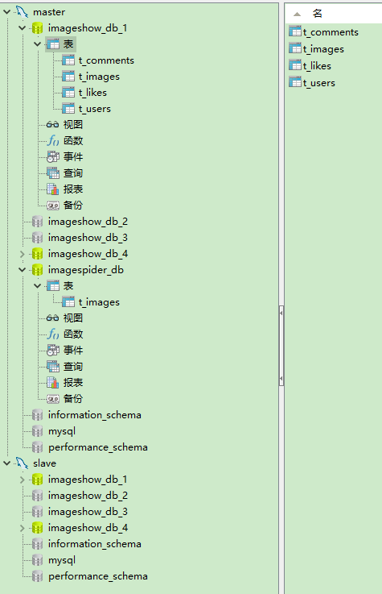

# go分库分表 主从分离例子

网上有很多介绍分库分表的文章，方法很多：
```
分区表切分
垂直切分
水平切分
区间切分
取模切分
```
这里不细说


分库分表简单，但后期会带来一系列的难题：
```
事务
Join
分页
```

**数据库：**

```
master和slave是一个主从架构
imagespider_db：[ImageSpider](https://github.com/bccber/imagespider)项目采集回来的数据，不需要部署主从分离。
imageshow_db_1、imageshow_db_2、imageshow_db_3、imageshow_db_4:
四个分库的结构一模一样。(注意，分库的个数最好是2的N次方，不然基因取模算法可能会失效)
```
**t_users用户表：**
```
用户登录和注册时，需要用name来定位分库；查看用户资料时，需要用uid定位分库，
所以，把name的基因加入到uid中，uid的最后2bit为name的crc32的最后2bit，这样通过uid和name都能定位到分库。
```
**t_images图片表：** 
```
按 id % 4分库，分页时采用“禁止跳页法”。
```
**t_comments评论表：** 
```
id的最后2bit为imgid的2bit，保证一张图片的所有评论和图片切分到同一个数据库中。
用户评论时，t_images表的comment_count字段加1，因为是同一个数据库，仍然可以使用事务处理；
所有评论都切分到同一个数据库，分页时可以使用传统方法。
```

**t_likes点赞表：** 
```
和t_comments表一样，也使用imgid最后2bit作为分库基因。
```
```
在某些场景下，使用基因切分法，把相关表都切分到同一个数据库中，在后期的操作中仍然可以使用事务，Join等操作，
但可能会导致分库数据不均衡。
ImageShow只是一个水平切分的例子，功能，代码都很简单，肯定不能涵盖分库分表的所有应用场景。
```